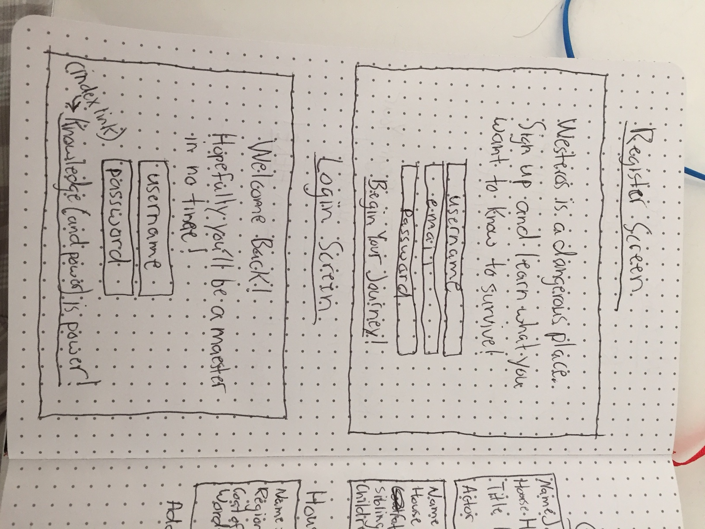
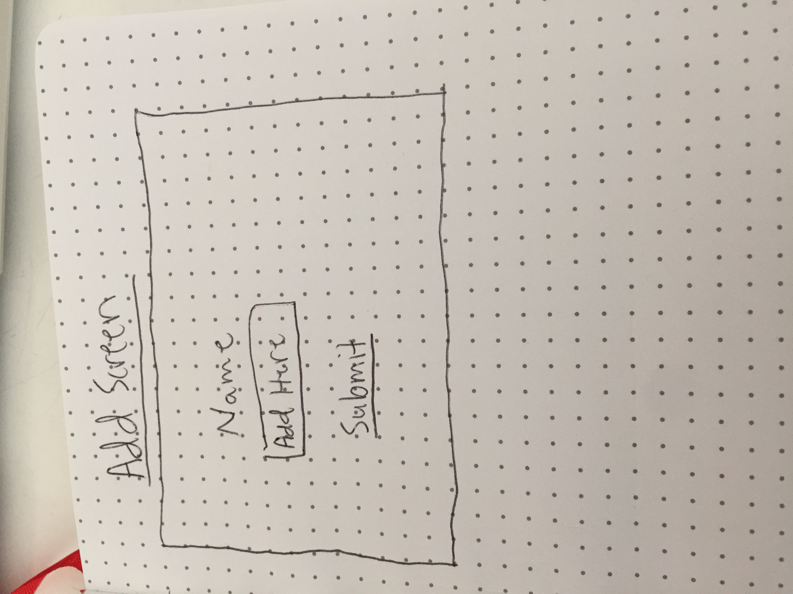

# Game-of-Thrones-for-Dummies

## Game of Thrones for Dummies

## Wireframes
### Main page to login and register

### Register and Login Screens

### Main Character List Index

### Add a character to your list

### Single Character View

## What is Game of Thrones For Dummies?

Game of Thrones is the most popular show on television beloved by millions
around the world. There is a group of fans like myself who obsessively keep
track of every character, house, and event that happens throughout the show
and beyond, but there are many more casual viewers who tune in for the spectacle
but struggle to remember all of the countless characters that have 
appeared on the show through its near 7-season run. 

My app will allow these casual viewers and those who have not seen the show who are ready to dip their toes in to do so at their own pace. If there's a character from the show that you're unclear on or just want to learn more about, all you'll have to do is just type in their name and from there, you will have key information associated with that character that you will be able to view, such as titles, aliases, their allegiance, and the name of the actor who portrays them in the show.

The app will also have user authentication, so that each user's list will be password
protected and they can keep their knowledge (or lack thereof) private.

## How Does Game of Thrones For Dummies Work?

When you go to [Game of Thrones For Dummies](gameofthronesfordummies.herokuapp.com),
You will be prompted to register if you are a new user or log in if you are a returning
user. For new users, click on 'Register Here' and you will be guided to a registration page
where you will provide a username, email address, and password. Upon completion, you will
automatically be directed to your very own character list, which, because you've just created
a new account, will have no names on it (yet). If you are a returning user, you can click
'Login Here' from the homepage and it will take you to a screen where you will be prompted to
enter your username and password. Doing so will take you to your character page. No actions
after the home, register, and login screens can take place unless the user is logged in.

Once the user is logged in, he or she can now add a character. Just click on the 'Add Character'
link and a new screen will pop up with an input for the user to type in a character name (i.e. Jon Snow). Click 'Add Character Name' and the user will be redirected to their character list page, where that character's name will now be prominently displayed. 

Under the name will be two prompts: one to see more info and the other to delete the character. When a user clicks 'See More Info', the app will make a call to the API of Ice and Fire and when the page appears, there will be new information associated with that character listed under their name. When the user wants to return to his or her main character page from this view, just click 'See All Characters', and the character index view will show up with the names of every character the user has typed in so far. 

If the user is either confident they know enough about the character or he or she does not want too many characters in their list at once, each character has a 'Delete' button that will remove that character's name from the page and the 'See More Info' and 'Delete' values that appear with each character name will no longer be on the page.

When a user wants to log out, there is a link at the bottom of the page stating 'Until Next Time..The Night is Dark and Full of Terrors.' Users can click on that link and they will be return to the app's home screen where they can log in again if they choose.

## Technologies Used

I set up the functionality of this app primarily through Node.js and the Express framework. I also used several node package modules (npms) to help with certain actions the app needed to run as well as for user authentication.

### List of NPMs used in this project
    `bcryptjs`
    `body-parser`
    `cookie-parser`
    `dotenv`
    `ejs`
    `express`
    `express-session`
    `isomorphic-fetch`
    `method-override`
    `morgan`
    `passport`
    `passport-local`
    `pg-promise`

In order to make my API calls, I used both the `Ajax` and `fetch` methods. I used ajax to make my initial API call to return all the information I wanted for each character. However, some of these character traits, such as allegiances, required another API call to be made to retrieve the name of that allegiance. For this, I used fetch, setting up helper functions retrieve that data and render it on the page as a string instead of as a link, which would've been the case if I had just made my ajax call.

I used CSS for styling the page and instead of HTML, I used 'EJS' to provide the layout of my pages. This allowed me to use simple loops and if statements to control which data I wanted to render on each page.    
