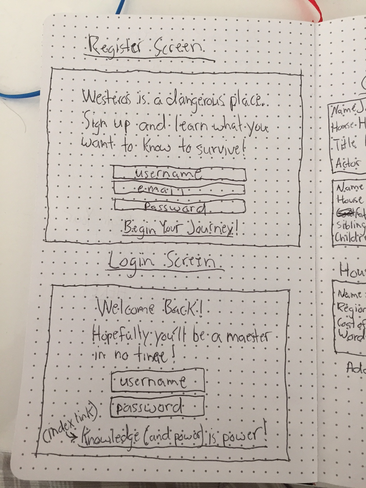
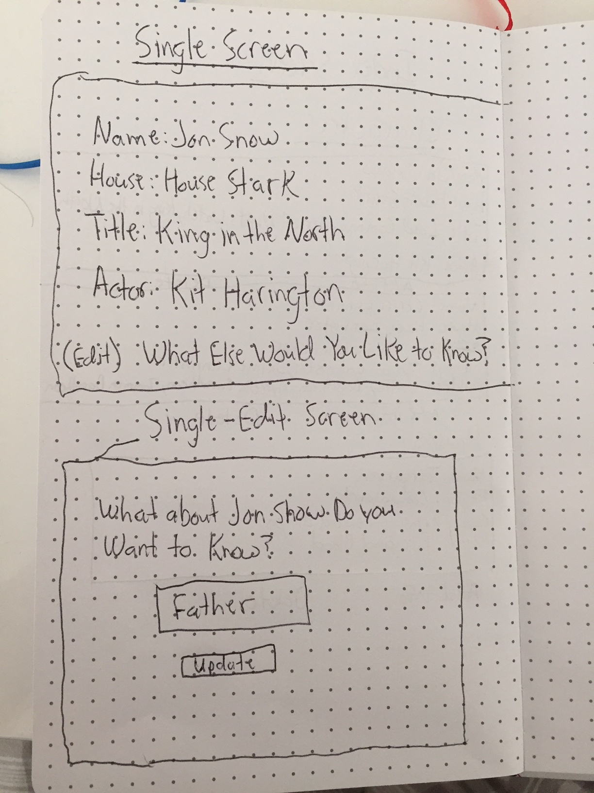

# Game of Thrones For Dummies (or Cliffnotes. Still unsure which is more appropriate branding)

## What is Game of Thrones for Dummies?

Game of Thrones is the most popular show on television beloved by millions
around the world. There is a group of fans like myself who obsessively keep
track of every character, house, and event that happens throughout the show
and beyond, but there are many more casual viewers who tune in for the spectacle
but struggle to remember the names of the countless characters that have 
appeared on the show through its near 7-season run. 

My app will allow these casual viewers and those who have not seen the show who are ready to dip their toes in to do so at their own pace. If there's a character, house, event, allegiance, or
item from the World of Ice and Fire that you're unclear on or just want to learn
more about, all you'll have to do is just type in the name and whatever other
information you want, and with the help of the API of Ice and Fire, you'll
get the requisite info you seek and you'll be able to keep a running list 
of things you want to learn more about. If there's something else you want to 
know about a character, you'll be able to update that entry with a new trait.
When you feel that your knowledge is sufficient, you can delete that entry as well.

The app will also have user authentication, so that each user's list will be password
protected and they can keep their knowledge (or lack thereof) private.

## Wireframes

### Main page to login and register

### Register and Login Screens

### GoT Index Screen: List of things in your list

### Screen for each entry and Screen for updating info

### Add a character, house to your list

## Initial Thought on App Structure

One of the things I want to be able to do is make the main data table change
based on what information the user wants. The API is a bit limited in terms of what
information it can call and which information is available for each character or house,
but for basics, which is what I'm going for here, it can get the job done.

In that spirit, when it comes to editing data, I would like to be able have users
be able to add things they want. For example, if a user has an entry for Jon Snow that
says he's from House Stark, they could get other information, such as when he was born
or the name of the actor who plays him on the show or which seasons of the show he's in.

## Phases of Completion

### Phase 0

Set up file structure for the app without auth and create databases.

### Phase 1

Have main index page of info user wants appear with add and delete functionality.
Each piece of info have its own div and link to an edit page.

### Phase 2

Link the API to the app

### Phase 3

Create edit functionality that will allow the user to add information to existing
entries in their list. The screen will prompt which type of information the user wants to
add based on the entry retrieved from the API. For example, if the user wants to know Jon
Snow's father, when they retrieve that information, they won't receive anything because
that information is not confirmed (even for those R+L=J truthers out there).

### Phase 4

Enable authentication that will allow each user to customize their own list of characters
they want to keep track of at any given time. Create a home screen that will direct users to
register and login pages. Create those register and login pages, which will direct the user
to their list.

### Phase 5

Style the app with CSS.

### Phase 6

Deploy to Heroku and hope for the best.

## Database structure
CREATE TABLE users
VALUES
(id, username, email, password_digest)

ALTER TABLE GoT
ADD COLUMN user_id INTEGER REFERENCES users(id);

CREATE TABLE GoT
VALUES
(character_name, house, actor_name)

### Want ability to alter the GoT table based on which information the user wants   
